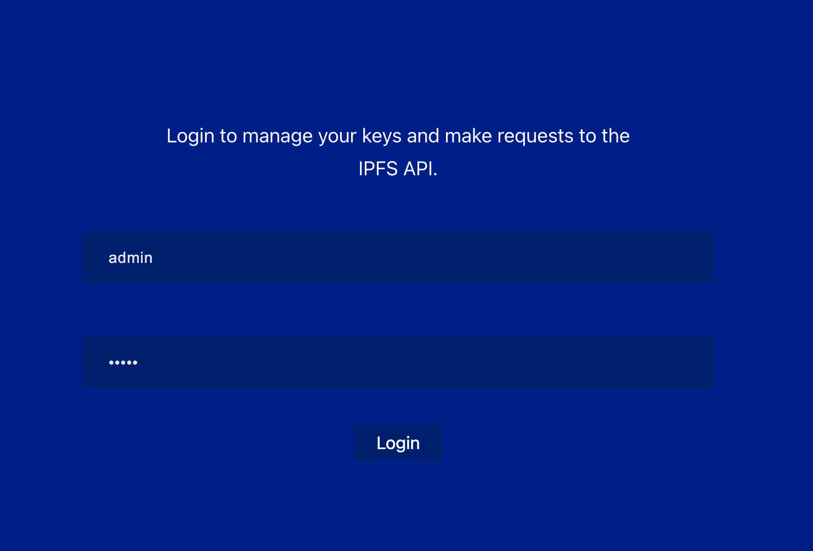
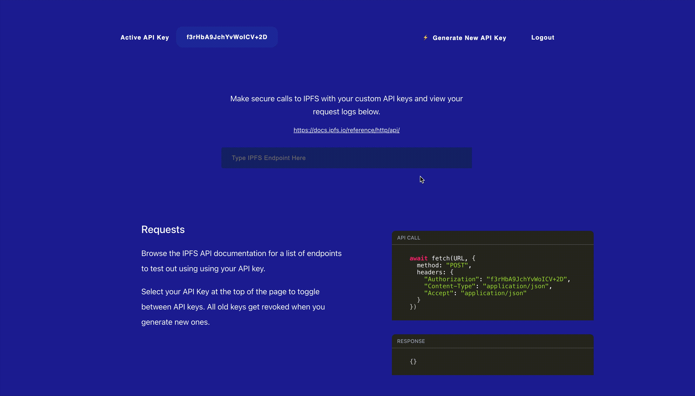

<!-- GETTING STARTED -->
## Getting Started

To get a local copy up and running follow these simple steps.

### Prerequisites

First you'll need to have a few core applications installed, including Node, Yarn, and IPFS installed
* Node installation: https://nodejs.org/en/download/
* Yarn installation: https://classic.yarnpkg.com/en/docs/install/#mac-stable
* IPFS CLI installation: https://docs.ipfs.io/install/command-line/

### Installation

1. Clone the repo
  ```sh
  git clone https://github.com/ryanwaits/ipfs_api.git
  cd ipfs_api
  ```
2. Make sure you've initialized IPFS
  ```sh
  ipfs init
  ```
3. In order to handle cross origin requests on IPFS, we need to set it in our local config. Otherwise, we will get a 403 Forbidden error on all of our API calls from our browser
  ```sh
  ipfs config --json API.HTTPHeaders.Access-Control-Allow-Origin '["*"]'
  ```
4. Install nodemon package globally for running our backend server
  ```sh
    npm install nodemon -g
  ```
5. Install all app dependencies
  ```sh
    yarn install
  ```
6. Start up your React app, Node.js server, and IPFS node
```sh
  yarn dev
```

<!-- USAGE EXAMPLES -->
## Usage

### Logging in
**There is no way to create a new user for now.**

The current version of the app has an admin account seeded into the local db.

You can login to the app by using ```admin``` for the username and ```12345``` for the password.



### Making requests

The db comes with a single seeded API key, which is active, so you can get started right away making requests. You can also view the request and response code after you make your call.



### Smoke test

Currently, the app allows you to generate a new key by clicking the appropriate link near the top of the page. What this does is disable the old API key that was being used, and activates the new one.

You can run through a few tests to make sure the old key is no longer valid by clicking the top left corner where your API key is and selecting the old API key. This will change your Authorization header to the old key and result in a failing call.

You can view all requests + activity in the Activity Logs at the bottom of the dashboard.


